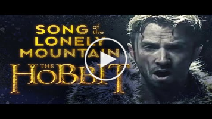

# 


<h1 align="center">
  <br>
  <a href="http://github.com/cakehappens/frosting"></a>
  <br>
  Lonely Mountain
  <br>
</h1>

<h4 align="center">A set of useful functions for Jsonnet 🏔️</h4>

<p align="center">
  <a href="./docs/README.md">
    
  </a>
  <a href="https://saythanks.io/to/ghostsquad">
    
  </a>
  <a href="buymeacoff.ee/50onA1pjc">
    
  </a>
  <a href="./LICENSE">
    
  </a>
</p>

<p align="center">
  <a href="#introduction">Introduction</a> •
  <a href="#install">Install</a> •
  <a href="#how-to-use">How To Use</a> •
  <a href="#credits">Credits</a> •
  <a href="#related">Related</a> •
  <a href="#credits">License</a> •
  <a href="#license">License</a>
</p>

## Introduction

`Lonely Mountain` is home to some artisanally crafted functions for use in your jsonnet! It's a natural extension to the standard library.

## Install

Install this library in your own project with jsonnet-bundler (the jsonnet package manager):

```shell
$ mkdir my-project; cd my-project
$ jb init  # Creates the initial/empty `jsonnetfile.json`
$ jb install github.com/cakehappens/lonely-mountain # Creates `vendor/` & `jsonnetfile.lock.json`, and fills in `jsonnetfile.json`
```

> jb can be installed with `go get github.com/jsonnet-bundler/jsonnet-bundler/cmd/jb`

In order to update the lonely-mountain dependency, simply use the jsonnet-bundler update functionality:

```shell
$ jb update
```

## How To Use

```jsonnet
local lm = import "github.com/cakehappens/lonely-mountain/main.libsonnet"

lm.strings.capitalize("hello")
```

```
Hello
```

You can find more information in [the docs](./docs)!

## Lore

> The Lonely Mountain, or Erebor, was a mountain in the north-east of Rhovanion. It was the source of the river Running, and a major Dwarven stronghold, the Kingdom under the Mountain at the end of the Third Age and well into the Fourth.

> "[Dwarves] are stone-hard, stubborn, fast in friendship and in enmity, and they suffer toil and hunger and hurt of body more hardily than all other speaking peoples; and they live long, far beyond the span of Men, yet not forever."
― The Silmarillion, "Of Aulë and Yavanna"

> The Dwarves were beings of short stature, often friendly with Hobbits although long suspicious of Elves. They were typically blacksmiths and stoneworkers by profession, unrivalled in some of their arts even by the Elves.

> While there were several tribes (Houses) of the Dwarves, the most prominent was that of the Longbeards.

Ref: [tolkien gateway](http://tolkiengateway.net/wiki/Lonely_Mountain)

## Related

[](https://www.youtube.com/watch?v=RI3fkqA9-IA)

## Credits

<div>Icons made by <a href="http://www.freepik.com/" title="Freepik">Freepik</a> from <a href="https://www.flaticon.com/" title="Flaticon">www.flaticon.com</a></div>

## License

Apache 2.0
